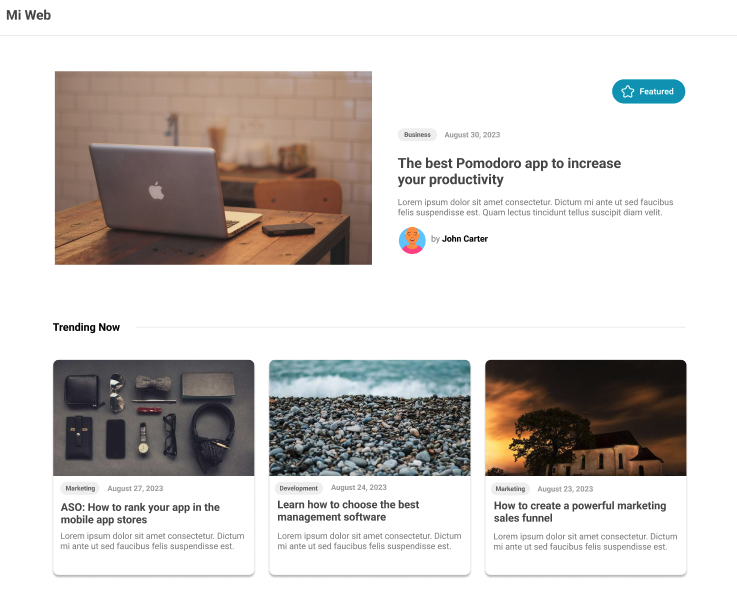
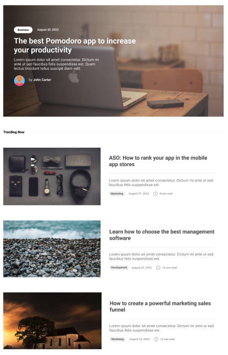

# Actividad evaluativa #1

La empresa COMPUMUNDO HIPERMEGA RED te solicita crear su blog personal. Para ello, te ofrecen como opciones los siguientes diseños. 

### Opción #1

### Opción #2

Tu misión, si decides aceptarla,  será construir la landing page del blog personal del cliente eligiendo uno de los diseños propuestos. 

## Mínimos requeridos por el cliente

La entrega final deberá cumplir como mínimo los siguientes items:

- Todas la imágenes deberán incluir ALTs
- Utilizar BEM
- Utiliza HTML Semántico
- Tu código HTML y CSS deberá ser formateado a 2 espacios
- El código debe ser legible y ordenado
- Desplegar tu solución utilizando github pages

## Consideraciones generales

- Utilizar únicamente HTML y CSS
- Utilizar el siguiente <a href="https://www.figma.com/file/YrjuUaL3Mu7ijrIYOcadnc/Actividad-Evaluativa-1?type=design&node-id=0%3A1&mode=design&t=GO4sFrnmLevfaLdt-1" target="_blank">link de figma</a> como referencia.

## Hacker edition

Una vez alcances los mínimos requeridos por el cliente, la pregunta es...Cuál es el factor diferenciador que tienes para ofrecer que hará que el cliente elija tu propuesta? Siéntete libre de proponer cualquier cosa que consideres pueda satisfacer las necesidades del cliente

